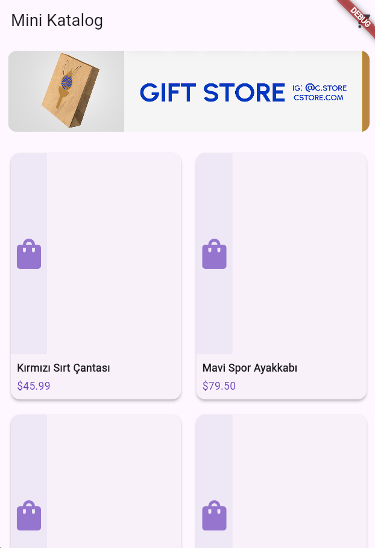
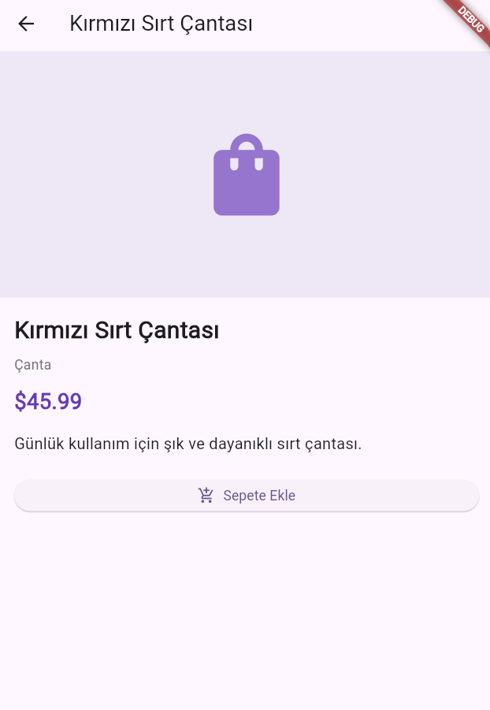
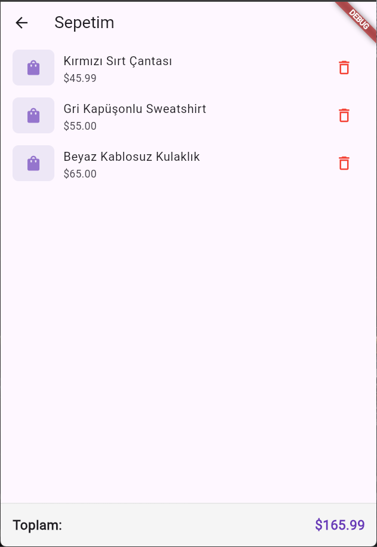

# 🛍️ Mini Katalog App

Flutter ile geliştirilmiş, JSON simülasyonu ile ürün verisi sunan, sepet sistemi içeren mini bir katalog uygulaması. Bu proje, 5 günlük bir Flutter eğitim programı kapsamında geliştirilmiştir.

## 📱 Özellikler

- Ürünleri ızgara (grid) görünümünde listeleme
- Ürün detay sayfası (başlık, fiyat, kategori, açıklama)
- Sepete ürün ekleme / çıkarma
- Toplam tutar hesaplama
- Singleton + `ValueNotifier` ile state yönetimi (ekstra paket kullanılmadan)
- JSON simülasyonu ile veri modelleme (`fromJson`)
- Yerel asset (banner görseli) yönetimi

## 🛠️ Kullanılan Teknolojiler

- **Flutter** 3.44.6
- **Dart**
- Sadece `material.dart` (ekstra paket kullanılmamıştır)

## 📂 Proje Yapısı

lib/
├── main.dart
├── models/
│   ├── product.dart          # Product veri modeli (fromJson)
│   ├── product_service.dart  # JSON simülasyonu ile veri sağlama
│   └── cart_manager.dart     # Sepet state yönetimi (Singleton)
└── views/
├── home_screen.dart          # Ana sayfa (banner + ürün ızgarası)
├── product_detail_screen.dart # Ürün detay sayfası
└── cart_screen.dart          # Sepet sayfası
assets/
└── images/
└── banner.png             # Uygulama banner görseli

## 🚀 Kurulum ve Çalıştırma

1. Depoyu klonlayın:
```bash
   git clone https://github.com/busrasm/mini_katalog_app.git
   cd mini_katalog_app
```

2. Bağımlılıkları yükleyin:
```bash
   flutter pub get
```

3. Uygulamayı çalıştırın:
```bash
   flutter run
```

## 📸 Ekran Görüntüleri

<p align="center">
  
  
  
</p>

## 📌 Sürüm

**v1.0.0** — İlk tam sürüm (Ürün listeleme, detay, sepet sistemi, banner)

## 👤 Geliştirici

Bu proje, Flutter öğrenimi kapsamında 5 günlük bir eğitim projesi olarak geliştirilmiştir.